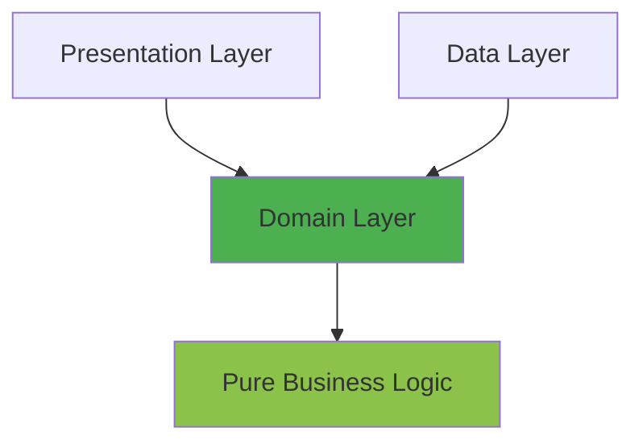

Clean Architecture emphasizes separation of concerns through distinct layers, each with specific responsibilities and dependency rules.

## The Dependency Rule

<Warning>
  **The Golden Rule**: Source code dependencies must point only inward, toward higher-level policies. Nothing in an inner circle can know anything about something in an outer circle.
</Warning>

In this architecture:



- **Domain Layer** (innermost) - Has zero dependencies
- **Data Layer** - Depends only on Domain
- **Presentation Layer** - Depends on Domain (and sometimes Data for DI)

## Layer Structure

### Domain Layer: The Core

The domain layer is the heart of the application, containing pure business logic with **zero framework dependencies**.

<AccordionGroup>
  <Accordion title="Use Cases" icon="gear">
    Encapsulate business operations and orchestrate the flow of data:

    ```kotlin user-component/src/commonMain/kotlin/com/denisbrandi/androidrealca/user/domain/usecase/LoginUseCase.kt
    internal class LoginUseCase(
        private val userRepository: UserRepository
    ) : Login {
        override suspend fun invoke(loginRequest: LoginRequest): Answer<Unit, LoginError> {
            return when {
                !Email(loginRequest.email).isValid() -> {
                    Answer.Error(LoginError.InvalidEmail)
                }

                !Password(loginRequest.password).isValid() -> {
                    Answer.Error(LoginError.InvalidPassword)
                }

                else -> {
                    return userRepository.login(loginRequest)
                }
            }
        }
    }
    ```

    Notice:
    - No Android imports
    - Pure business logic
    - Depends only on domain interfaces
  </Accordion>

  <Accordion title="Domain Models" icon="cube">
    Represent business entities with validation and behavior:

    ```kotlin user-component/src/commonMain/kotlin/com/denisbrandi/androidrealca/user/domain/model/Email.kt
    class Email(private val value: String) {
        fun isValid(): Boolean {
            return value.isNotBlank() && value.matches(Regex(EMAIL_ADDRESS_PATTERN))
        }

        private companion object {
            const val EMAIL_ADDRESS_PATTERN =
                "(?:[a-zA-Z0-9!#\$%&'*+/=?^_`{|}~-]+(?:\\.[a-zA-Z0-9!#\$%&'*+/=?^_`{|}~-]+)*|\"(?:[\\x01-\\x08\\x0b\\x0c\\x0e-\\x1f\\x21\\x23-\\x5b\\x5d-\\x7f]|\\\\[\\x01-\\x09\\x0b\\x0c\\x0e-\\x7f])*\")@(?:(?:[a-zA-Z0-9](?:[a-zA-Z0-9-]*[a-zA-Z0-9])?\\.)+[a-zA-Z0-9](?:[a-zA-Z0-9-]*[a-zA-Z0-9])?|\\[(?:(?:25[0-5]|2[0-4][0-9]|[01]?[0-9][0-9]?)\\.){3}(?:25[0-5]|2[0-4][0-9]|[01]?[0-9][0-9]?|[a-zA-Z0-9-]*[a-zA-Z0-9]:(?:[\\x01-\\x08\\x0b\\x0c\\x0e-\\x1f\\x21-\\x5a\\x53-\\x7f]|\\\\[\\x01-\\x09\\x0b\\x0c\\x0e-\\x7f])+)\\])"
        }
    }
    ```

    Domain models encapsulate business rules and validation.
  </Accordion>

  <Accordion title="Repository Interfaces" icon="database">
    Define contracts for data access without implementation details:

    ```kotlin wishlist-component/src/commonMain/kotlin/com/denisbrandi/androidrealca/wishlist/domain/repository/WishlistRepository.kt
    internal interface WishlistRepository {
        fun addToWishlist(userId: String, wishlistItem: WishlistItem)
        fun removeFromWishlist(userId: String, wishlistItemId: String)
        fun observeWishlist(userId: String): Flow<List<WishlistItem>>
    }
    ```

    The domain defines what it needs, not how it's implemented.
  </Accordion>
</AccordionGroup>

### Data Layer: Implementation

The data layer implements domain interfaces and handles data sources:

```kotlin product-component/src/commonMain/kotlin/com/denisbrandi/androidrealca/product/data/repository/RealProductRepository.kt
internal class RealProductRepository(
    private val httpClient: HttpClient
) : ProductRepository {
    override suspend fun getProducts(): Answer<List<Product>, Unit> {
        return try {
            val response =
                httpClient.get("https://api.json-generator.com/templates/Vc6TVI8VwZNT/data") {
                    headers {
                        append(HttpHeaders.ContentType, ContentType.Application.Json.toString())
                        val accessTokenHeader = AccessTokenProvider.getAccessTokenHeader()
                        append(accessTokenHeader.first, accessTokenHeader.second)
                    }
                }
            if (response.status.isSuccess()) {
                handleSuccessfulProductsResponse(response)
            } else {
                Answer.Error(Unit)
            }
        } catch (t: Throwable) {
            Answer.Error(Unit)
        }
    }

    private suspend fun handleSuccessfulProductsResponse(httpResponse: HttpResponse): Answer<List<Product>, Unit> {
        val responseBody = httpResponse.body<List<JsonProductResponseDTO>>()
        return Answer.Success(mapProducts(responseBody))
    }

    private fun mapProducts(jsonProducts: List<JsonProductResponseDTO>): List<Product> {
        return jsonProducts.map { jsonProduct ->
            Product(
                jsonProduct.id.toString(),
                jsonProduct.name,
                Money(jsonProduct.price, jsonProduct.currency),
                jsonProduct.imageUrl
            )
        }
    }
}
```

<Info>
  The repository implements the domain interface but handles all implementation details like HTTP clients, JSON mapping, and error handling.
</Info>

### Presentation Layer: UI Logic

The presentation layer coordinates UI state and user interactions:

```kotlin wishlist-ui/src/main/java/com/denisbrandi/androidrealca/wishlist/presentation/viewmodel/RealWishlistViewModel.kt
internal class RealWishlistViewModel(
    observeUserWishlist: ObserveUserWishlist,
    private val removeFromWishlist: RemoveFromWishlist,
    private val addCartItem: AddCartItem,
    private val stateDelegate: StateDelegate<WishlistScreenState>
) : WishlistViewModel, StateViewModel<WishlistScreenState> by stateDelegate, ViewModel() {
    init {
        stateDelegate.setDefaultState(WishlistScreenState())
        observeUserWishlist().onEach { wishlistItems ->
            stateDelegate.updateState { WishlistScreenState(wishlistItems) }
        }.launchIn(viewModelScope)
    }

    override fun removeItemFromWishlist(wishlistItemId: String) {
        removeFromWishlist(wishlistItemId)
    }

    override fun addProductToCart(wishlistItem: WishlistItem) {
        addCartItem(
            CartItem(
                id = wishlistItem.id,
                name = wishlistItem.name,
                money = wishlistItem.money,
                imageUrl = wishlistItem.imageUrl,
                quantity = 1
            )
        )
    }
}
```

## Framework Independence

<Tabs>
  <Tab title="Domain Layer">
    Component modules use **Kotlin Multiplatform** to ensure framework independence:

    ```kotlin cart-component/build.gradle.kts
    kotlin {
        jvmToolchain(17)
        jvm()
        iosX64()
        iosArm64()
        iosSimulatorArm64()
        sourceSets {
            commonMain {
                dependencies {
                    implementation(libs.coroutines.core)
                    implementation(libs.kotlin.serialization)
                    implementation(project(":cache"))
                    implementation(project(":money-component"))
                    implementation(project(":user-component"))
                }
            }
        }
    }
    ```

    Notice: **No Android dependencies**
  </Tab>

  <Tab title="UI Layer">
    UI modules depend on Android but delegate all logic to the domain:

    ```kotlin cart-ui/build.gradle.kts
    android {
        namespace = "com.denisbrandi.androidrealca.cart.ui"
        compileSdk = 36
    }

    dependencies {
        implementation(project(":foundations"))
        implementation(project(":cart-component"))
        implementation(project(":viewmodel"))
        implementation(libs.lifecycle.viewmodel)
        implementation(libs.androidx.material3)
    }
    ```
  </Tab>
</Tabs>

## Benefits of Layer Separation

<CardGroup cols={2}>
  <Card title="Independent Testing" icon="flask">
    Test business logic without Android framework or UI dependencies
  </Card>
  <Card title="Platform Portability" icon="mobile">
    Domain layer can be reused across iOS, Web, Desktop
  </Card>
  <Card title="Faster Compilation" icon="bolt">
    Component modules compile faster without Android framework
  </Card>
  <Card title="Clear Boundaries" icon="border-all">
    Each layer has a single, well-defined responsibility
  </Card>
</CardGroup>

## Error Handling

The architecture uses a custom `Answer` type for functional error handling:

```kotlin foundations/src/commonMain/kotlin/com/denisbrandi/androidrealca/foundations/Answer.kt
sealed class Answer<out T, out E> {
    data class Success<out T>(
        val data: T,
    ) : Answer<T, Nothing>()

    data class Error<out E>(
        val reason: E,
    ) : Answer<Nothing, E>()

    fun <C> fold(
        success: (T) -> C,
        error: (E) -> C,
    ): C =
        when (this) {
            is Success -> success(data)
            is Error -> error(reason)
        }
}
```

<Tip>
  The `Answer` type makes error handling explicit and type-safe, avoiding exceptions for expected error cases.
</Tip>

## Next Steps

<CardGroup cols={2}>
  <Card title="SOLID Principles" href="/architecture/solid-principles" icon="cube">
    See how SOLID principles are applied
  </Card>
  <Card title="Modularization" href="/architecture/modularization" icon="boxes-stacked">
    Learn about the module structure
  </Card>
</CardGroup>