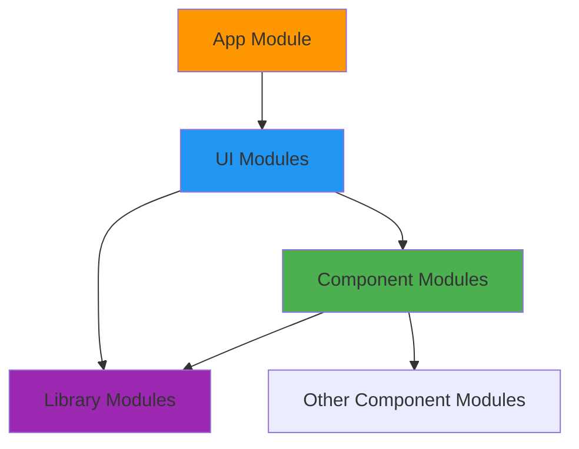

This project uses a **Package by Component** modularization strategy, organizing code into distinct, feature-driven modules that support scalability and maintainability.

## Package by Component

<Info>
  Package by Component groups all layers (domain, data, presentation) related to a specific feature or business capability into dedicated modules.
</Info>

For example, the wishlist feature is split into:
- `wishlist-component` - Domain and data layers
- `wishlist-ui` - Presentation layer

This differs from "Package by Layer" where all domain logic would be in one module, all data logic in another, etc.

### Why Package by Component?

<CardGroup cols={2}>
  <Card title="Feature Isolation" icon="box">
    Each feature is self-contained and can be developed independently
  </Card>
  <Card title="Parallel Development" icon="users">
    Multiple teams can work on different features without conflicts
  </Card>
  <Card title="Faster Builds" icon="rocket">
    Gradle only rebuilds changed modules and their dependents
  </Card>
  <Card title="Clear Ownership" icon="user-shield">
    Teams own complete vertical slices of functionality
  </Card>
</CardGroup>

## Module Types

The architecture defines four distinct module types:

### 1. Library Modules

<Accordion title="Purpose & Examples">
  General-purpose utilities that can be reused across the entire project.

  **Examples:**
  - `cache` - Key-value storage functionality
  - `httpclient` - Network request handling
  - `viewmodel` - ViewModel utilities without framework coupling
  - `designsystem` - Reusable UI components
  - `foundations` - Language utilities not provided by Kotlin

  **Characteristics:**
  - Minimal dependencies
  - No business logic
  - Highly reusable
</Accordion>

```kotlin cache/src/commonMain/kotlin/com/denisbrandi/androidrealca/cache/RealCachedObject.kt
class RealCachedObject<T : Any>(
    private val fileName: String,
    private val settings: Settings,
    private val serializer: KSerializer<T>,
    private val defaultValue: T
) : CachedObject<T> {
    override fun put(value: T) {
        settings.encodeValue(serializer, fileName, value)
    }

    override fun get(): T {
        return settings.decodeValue(serializer, fileName, defaultValue)
    }
}
```

### 2. Component Modules

<Accordion title="Purpose & Examples">
  Contain the **domain** and **data layers** for a specific feature.

  **Examples:**
  - `cart-component` - Cart domain logic and data storage
  - `wishlist-component` - Wishlist domain logic and data storage
  - `product-component` - Product domain logic and API integration
  - `user-component` - User authentication and data management
  - `money-component` - Money domain object shared across features

  **Characteristics:**
  - Pure Kotlin or Kotlin Multiplatform
  - No Android framework dependencies
  - Faster compilation
  - Portable across platforms
</Accordion>

```kotlin cart-component/build.gradle.kts
plugins {
    alias(libs.plugins.kotlin.multiplatform)
    alias(libs.plugins.kotlin.serialization)
}

kotlin {
    jvmToolchain(17)
    jvm()
    iosX64()
    iosArm64()
    iosSimulatorArm64()
    sourceSets {
        commonMain {
            dependencies {
                implementation(libs.coroutines.core)
                implementation(libs.kotlin.serialization)
                implementation(project(":cache"))
                implementation(project(":money-component"))
                implementation(project(":user-component"))
            }
        }
        commonTest {
            dependencies {
                implementation(libs.kotlin.test)
                implementation(libs.coroutines.test)
                implementation(project(":cache-test"))
                implementation(project(":flow-test-observer"))
            }
        }
    }
}
```

<Note>
  Notice the multiplatform targets (JVM, iOS) and **zero Android dependencies**. Component modules compile much faster because they don't need the Android framework.
</Note>

### 3. UI Modules

<Accordion title="Purpose & Examples">
  Responsible for the **presentation layer** of a specific feature.

  **Examples:**
  - `cart-ui` - Cart screen and ViewModels
  - `wishlist-ui` - Wishlist screen and ViewModels
  - `plp-ui` - Product list page UI
  - `onboarding-ui` - Login screen
  - `main-ui` - Main screen with bottom navigation
  - `money-ui` - Reusable price display components

  **Characteristics:**
  - Android library modules
  - Depend on component modules
  - Can aggregate multiple features in one view
</Accordion>

```kotlin cart-ui/build.gradle.kts
plugins {
    alias(libs.plugins.android.library)
    alias(libs.plugins.compose.compiler)
}

android {
    namespace = "com.denisbrandi.androidrealca.cart.ui"
    compileSdk = 36
    buildFeatures {
        compose = true
    }
}

dependencies {
    implementation(project(":foundations"))
    implementation(project(":money-component"))
    implementation(project(":cart-component"))  // Depends on component module
    implementation(project(":money-ui"))
    implementation(project(":viewmodel"))
    implementation(project(":designsystem"))
    
    implementation(libs.lifecycle.viewmodel)
    implementation(libs.androidx.material3)
}
```

<Tip>
  UI modules can depend on multiple component modules, allowing screens to aggregate data from different features.
</Tip>

### 4. App Module

<Accordion title="Purpose">
  The central module that integrates and orchestrates all other modules.

  **Responsibilities:**
  - Dependency injection setup
  - Navigation configuration
  - Application-level lifecycle management
  - Module integration

  **Characteristics:**
  - Android application module
  - Depends on all UI modules
  - Contains no business logic
</Accordion>

## Module Dependency Rules

<Warning>
  **Strict Dependency Rules:**
  - Component modules can only depend on other component modules or library modules
  - Component modules **cannot** depend on UI modules
  - UI modules can depend on component modules and library modules
  - App module depends on UI modules (and transitively gets component modules)
</Warning>



## Real Example: Cart Feature

The cart feature demonstrates the modularization strategy:

### cart-component Module

**Domain Layer:**
```kotlin cart-component/src/commonMain/kotlin/com/denisbrandi/androidrealca/cart/domain/model/Cart.kt
package com.denisbrandi.androidrealca.cart.domain.model

import com.denisbrandi.androidrealca.money.domain.model.Money

data class Cart(val cartItems: List<CartItem>) {
    fun getSubtotal(): Money? {
        return if (cartItems.isNotEmpty()) {
            val currency = cartItems[0].money.currencySymbol
            var subtotal = 0.0
            cartItems.forEach {
                subtotal += it.money.amount * it.quantity
            }
            Money(subtotal, currency)
        } else {
            null
        }
    }

    fun getNumberOfItems(): Int {
        return cartItems.sumOf { it.quantity }
    }
}
```

**Data Layer:**
```kotlin cart-component/src/commonMain/kotlin/com/denisbrandi/androidrealca/cart/data/repository/RealCartRepository.kt
internal class RealCartRepository(
    private val cacheProvider: CacheProvider
) : CartRepository {
    private val flowCachedObject: FlowCachedObject<JsonCartCacheDto> by lazy {
        cacheProvider.getFlowCachedObject(
            fileName = "cart-cache",
            serializer = JsonCartCacheDto.serializer(),
            defaultValue = JsonCartCacheDto(emptyMap())
        )
    }
    // Implementation...
}
```

### cart-ui Module

**Presentation Layer:**
```kotlin cart-ui/src/main/java/com/denisbrandi/androidrealca/cart/presentation/viewmodel/RealCartViewModel.kt
internal class RealCartViewModel(
    observeUserCart: ObserveUserCart,
    private val updateCartItem: UpdateCartItem,
    private val stateDelegate: StateDelegate<CartScreenState>
) : CartViewModel, StateViewModel<CartScreenState> by stateDelegate, ViewModel() {
    init {
        stateDelegate.setDefaultState(CartScreenState())
        observeUserCart().onEach { cart ->
            stateDelegate.updateState { CartScreenState(cart) }
        }.launchIn(viewModelScope)
    }
}
```

## Benefits of This Structure

<Tabs>
  <Tab title="Build Performance">
    **Faster Builds:**
    - Component modules compile without Android framework (much faster)
    - Gradle only rebuilds changed modules
    - Parallel compilation of independent modules

    **Example:** Changing `cart-component` only rebuilds:
    - `cart-component` itself
    - `cart-ui` (depends on cart-component)
    - `app` module

    It does **not** rebuild `wishlist-component`, `product-component`, etc.
  </Tab>

  <Tab title="Code Organization">
    **Clear Structure:**
    - Easy to find code related to a feature
    - Feature ownership is clear
    - New developers understand boundaries quickly

    **Example:** Everything related to wishlist:
    - Domain logic: `wishlist-component/domain`
    - Data logic: `wishlist-component/data`
    - UI: `wishlist-ui/presentation`
  </Tab>

  <Tab title="Reusability">
    **Platform Independence:**
    - Component modules work on iOS, JVM, etc.
    - Share business logic across platforms
    - Test once, use everywhere

    **Example:** `money-component` defines Money domain object used by:
    - cart-component
    - wishlist-component
    - product-component

    It can also be used in iOS app, backend services, etc.
  </Tab>

  <Tab title="Testing">
    **Testability:**
    - Test domain logic without Android
    - Mock dependencies at module boundaries
    - Fast test execution (no emulator needed)

    **Example:** Test cart business logic:
    ```kotlin
    @Test
    fun `getSubtotal calculates correct total`() {
        val cart = Cart(
            listOf(
                CartItem("1", "Product", Money(10.0, "$"), "url", 2),
                CartItem("2", "Product", Money(5.0, "$"), "url", 3)
            )
        )
        assertEquals(Money(35.0, "$"), cart.getSubtotal())
    }
    ```
    This test runs on JVM without Android framework.
  </Tab>
</Tabs>

## Module Overview

### Library Modules

| Module | Purpose |
|--------|--------|
| `cache` | Key-value storage functionality |
| `cache-test` | Testing utilities for cache module |
| `coroutines-test-dispatcher` | JUnit rules for coroutine testing |
| `designsystem` | Reusable UI components |
| `flow-test-observer` | Utilities for testing Flow emissions |
| `foundations` | Language utilities (e.g., Answer type) |
| `httpclient` | Network request handling |
| `viewmodel` | ViewModel utilities without framework coupling |

### Component Modules

| Module | Purpose |
|--------|--------|
| `cart-component` | Cart domain and data layers |
| `money-component` | Money domain object |
| `product-component` | Product domain and data layers |
| `user-component` | User authentication and data |
| `wishlist-component` | Wishlist domain and data layers |

### UI Modules

| Module | Purpose |
|--------|--------|
| `cart-ui` | Cart screen presentation |
| `main-ui` | Main screen with bottom navigation |
| `money-ui` | Reusable price display components |
| `onboarding-ui` | Login screen |
| `plp-ui` | Product list page |
| `wishlist-ui` | Wishlist screen presentation |

## Best Practices

<AccordionGroup>
  <Accordion title="Keep Component Modules Pure" icon="gem">
    Component modules should:
    - Use Kotlin Multiplatform (`commonMain`/`commonTest`)
    - Have zero Android dependencies
    - Be testable on JVM
    - Focus on business logic
  </Accordion>

  <Accordion title="UI Modules Can Aggregate" icon="layer-group">
    UI modules can depend on multiple component modules:
    ```kotlin
    dependencies {
        implementation(project(":cart-component"))
        implementation(project(":wishlist-component"))
        implementation(project(":product-component"))
    }
    ```
    This allows complex screens that combine multiple features.
  </Accordion>

  <Accordion title="Library Modules Should Be Generic" icon="puzzle-piece">
    Library modules should:
    - Provide general utilities
    - Have no business logic
    - Be reusable across any project
    - Have minimal dependencies
  </Accordion>

  <Accordion title="App Module: Integration Only" icon="plug">
    The app module should:
    - Set up dependency injection
    - Configure navigation
    - Initialize libraries
    - **NOT** contain business logic
  </Accordion>
</AccordionGroup>

<Warning>
  While this project uses multi-module approach for illustration, such extensive modularization may be unnecessary for smaller projects. Start simple and modularize as your project grows.
</Warning>

## Next Steps

<CardGroup cols={2}>
  <Card title="Architecture Overview" href="/architecture/overview" icon="sitemap">
    Return to the architecture overview
  </Card>
  <Card title="Clean Architecture" href="/architecture/clean-architecture" icon="circle-nodes">
    Learn about layer separation
  </Card>
  <Card title="SOLID Principles" href="/architecture/solid-principles" icon="cube">
    See SOLID principles in action
  </Card>
</CardGroup>