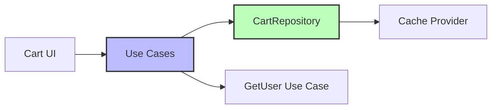
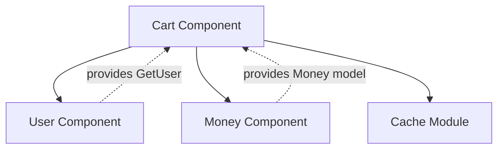

The Cart component manages the user's shopping cart, providing operations to add items, update quantities, and observe cart changes in real-time.

## Architecture



## Use Cases

The cart component exposes three primary use cases:

<CardGroup cols={3}>
  <Card title="AddCartItem" icon="plus">
    Add items to cart or increase quantity
  </Card>
  <Card title="UpdateCartItem" icon="pen">
    Update item quantity (including removal)
  </Card>
  <Card title="ObserveUserCart" icon="eye">
    Reactive observation of cart changes
  </Card>
</CardGroup>

### AddCartItem

Adds an item to the cart. If the item already exists, increases its quantity.

<CodeGroup>
```kotlin cart-component/src/commonMain/kotlin/com/denisbrandi/androidrealca/cart/domain/usecase/AddCartItemUseCase.kt
internal class AddCartItemUseCase(
    private val getUser: GetUser,
    private val cartRepository: CartRepository,
    private val updateCartItem: UpdateCartItem
) : AddCartItem {
    override fun invoke(cartItem: CartItem) {
        val cartItemInCart = cartRepository.getCart(getUser().id).cartItems.find {
            it.id == cartItem.id
        }
        if (cartItemInCart != null) {
            updateCartItem(cartItemInCart.copy(quantity = cartItemInCart.quantity + cartItem.quantity))
        } else {
            updateCartItem(cartItem)
        }
    }
}
```

```kotlin Interface
fun interface AddCartItem {
    operator fun invoke(cartItem: CartItem)
}
```
</CodeGroup>

<Tip>
  **Smart Merging**: The use case automatically detects if an item already exists in the cart and merges quantities instead of creating duplicates.
</Tip>

### UpdateCartItem

Updates a cart item. Setting quantity to 0 removes the item from the cart.

<CodeGroup>
```kotlin cart-component/src/commonMain/kotlin/com/denisbrandi/androidrealca/cart/domain/usecase/UpdateCartItemUseCase.kt
internal class UpdateCartItemUseCase(
    private val getUser: GetUser,
    private val cartRepository: CartRepository
) : UpdateCartItem {
    override fun invoke(cartItem: CartItem) {
        cartRepository.updateCartItem(getUser().id, cartItem)
    }
}
```

```kotlin Interface
fun interface UpdateCartItem {
    operator fun invoke(cartItem: CartItem)
}
```
</CodeGroup>

### ObserveUserCart

Provides a reactive `Flow` of cart changes for real-time UI updates.

<CodeGroup>
```kotlin cart-component/src/commonMain/kotlin/com/denisbrandi/androidrealca/cart/domain/usecase/ObserveUserCartUseCase.kt
internal class ObserveUserCartUseCase(
    private val getUser: GetUser,
    private val cartRepository: CartRepository
) : ObserveUserCart {
    override fun invoke(): Flow<Cart> {
        return cartRepository.observeCart(getUser().id)
    }
}
```

```kotlin Interface
fun interface ObserveUserCart {
    operator fun invoke(): Flow<Cart>
}
```
</CodeGroup>

## Domain Models

### Cart

The main domain entity representing a user's shopping cart.

```kotlin cart-component/src/commonMain/kotlin/com/denisbrandi/androidrealca/cart/domain/model/Cart.kt
data class Cart(val cartItems: List<CartItem>) {
    fun getSubtotal(): Money? {
        return if (cartItems.isNotEmpty()) {
            val currency = cartItems[0].money.currencySymbol
            var subtotal = 0.0
            cartItems.forEach {
                subtotal += it.money.amount * it.quantity
            }
            Money(subtotal, currency)
        } else {
            null
        }
    }

    fun getNumberOfItems(): Int {
        return cartItems.sumOf { it.quantity }
    }
}
```

<Accordion title="Cart Business Logic">
  - **getSubtotal()**: Calculates total price of all items in the cart
  - **getNumberOfItems()**: Returns total quantity across all cart items
  - Returns `null` subtotal for empty carts
  - Assumes all items share the same currency (uses first item's currency)
</Accordion>

### CartItem

Represents an individual item in the shopping cart.

```kotlin cart-component/src/commonMain/kotlin/com/denisbrandi/androidrealca/cart/domain/model/CartItem.kt
data class CartItem(
    val id: String,
    val name: String,
    val money: Money,
    val imageUrl: String,
    val quantity: Int
)
```

<ParamField path="id" type="String" required>
  Unique identifier for the product
</ParamField>

<ParamField path="name" type="String" required>
  Display name of the product
</ParamField>

<ParamField path="money" type="Money" required>
  Price information (amount + currency)
</ParamField>

<ParamField path="imageUrl" type="String" required>
  URL for the product image
</ParamField>

<ParamField path="quantity" type="Int" required>
  Number of items (0 = remove from cart)
</ParamField>

## Repository

The repository interface defines data operations:

```kotlin cart-component/src/commonMain/kotlin/com/denisbrandi/androidrealca/cart/domain/repository/CartRepository.kt
internal interface CartRepository {
    fun updateCartItem(userId: String, cartItem: CartItem)
    fun observeCart(userId: String): Flow<Cart>
    fun getCart(userId: String): Cart
}
```

### Implementation: RealCartRepository

The repository stores cart data in local cache using `CacheProvider`.

```kotlin cart-component/src/commonMain/kotlin/com/denisbrandi/androidrealca/cart/data/repository/RealCartRepository.kt
internal class RealCartRepository(
    private val cacheProvider: CacheProvider
) : CartRepository {

    private val flowCachedObject: FlowCachedObject<JsonCartCacheDto> by lazy {
        cacheProvider.getFlowCachedObject(
            fileName = "cart-cache",
            serializer = JsonCartCacheDto.serializer(),
            defaultValue = JsonCartCacheDto(emptyMap())
        )
    }

    override fun updateCartItem(userId: String, cartItem: CartItem) {
        val updatedCache = getUpdatedCacheForUser(userId) { userCart ->
            val cartItemInCache = userCart.find { it.id == cartItem.id }
            val cartItemDto = mapToDto(cartItem)
            if (cartItemInCache != null) {
                if (cartItem.quantity == 0) {
                    userCart.remove(cartItemInCache)
                } else {
                    val index = userCart.indexOf(cartItemInCache)
                    userCart[index] = cartItemDto
                }
            } else {
                userCart.add(cartItemDto)
            }
        }
        flowCachedObject.put(updatedCache)
    }

    override fun observeCart(userId: String): Flow<Cart> {
        return flowCachedObject.observe().map { cachedDto ->
            mapToCart(userId, cachedDto)
        }
    }

    override fun getCart(userId: String): Cart {
        return mapToCart(userId, flowCachedObject.get())
    }
    // ... mapping methods
}
```

<Note>
  The repository supports **multi-user carts** by storing separate cart data for each `userId`.
</Note>

## Key Features

<AccordionGroup>
  <Accordion title="Reactive Updates">
    Cart changes are broadcast via Kotlin `Flow`, allowing UI to automatically reflect updates.
  </Accordion>
  
  <Accordion title="Automatic Quantity Merging">
    Adding an existing item increases its quantity rather than creating duplicates.
  </Accordion>
  
  <Accordion title="Zero Quantity Removal">
    Setting `quantity = 0` automatically removes the item from the cart.
  </Accordion>
  
  <Accordion title="User Isolation">
    Each user has a separate cart stored by `userId`.
  </Accordion>
  
  <Accordion title="Persistent Storage">
    Cart data is persisted using the cache module, surviving app restarts.
  </Accordion>
</AccordionGroup>

## Dependencies



<CardGroup cols={2}>
  <Card title="User Component" icon="user" href="/components/user">
    Provides `GetUser` use case for accessing current user ID
  </Card>
  <Card title="Money Component" icon="dollar-sign" href="/components/money">
    Provides `Money` domain model for pricing
  </Card>
</CardGroup>

## Usage Example

```kotlin
// Add item to cart
val cartItem = CartItem(
    id = "product-123",
    name = "Widget",
    money = Money(29.99, "$"),
    imageUrl = "https://...",
    quantity = 2
)
addCartItem(cartItem)

// Observe cart changes
observeUserCart().collect { cart ->
    val subtotal = cart.getSubtotal()
    val itemCount = cart.getNumberOfItems()
    // Update UI
}

// Update quantity
updateCartItem(cartItem.copy(quantity = 5))

// Remove item
updateCartItem(cartItem.copy(quantity = 0))
```

## Testing

The component includes comprehensive tests:

<Steps>
  <Step title="Use Case Tests">
    Test business logic in isolation with mock repositories
    
    `AddCartItemUseCaseTest.kt`
    `ObserveUserCartUseCaseTest.kt`
    `UpdateCartItemUseCaseTest.kt`
  </Step>
  
  <Step title="Repository Tests">
    Test data layer with actual cache provider
    
    `RealCartRepositoryTest.kt`
  </Step>
  
  <Step title="Domain Model Tests">
    Test business logic in domain entities
    
    `CartTest.kt`
  </Step>
</Steps>

## Related Components

<CardGroup cols={2}>
  <Card title="Product Component" icon="box" href="/components/product">
    Products are added to cart as CartItems
  </Card>
  <Card title="Wishlist Component" icon="heart" href="/components/wishlist">
    Similar reactive pattern for wishlist management
  </Card>
</CardGroup>
