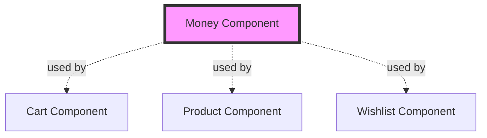
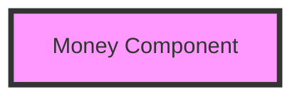

The Money component provides a simple but essential domain model for representing monetary values with currency information. It's a shared dependency used across multiple components.

## Overview

Unlike other components, the Money component contains **only a domain model** with no use cases, repositories, or data layer. It represents a pure domain concept shared across the application.



## Domain Model

### Money

Represents a monetary amount with its currency symbol.

```kotlin money-component/src/commonMain/kotlin/com/denisbrandi/androidrealca/money/domain/model/Money.kt
data class Money(val amount: Double, val currencySymbol: String)
```

<ParamField path="amount" type="Double" required>
  The numeric value of the money (e.g., 29.99)
</ParamField>

<ParamField path="currencySymbol" type="String" required>
  The currency symbol or code (e.g., "$", "€", "USD")
</ParamField>

## Design Rationale

### Why a Separate Component?

<AccordionGroup>
  <Accordion title="Shared Domain Model">
    Multiple components need to represent prices:
    - **Product**: Product price
    - **Cart**: Item price + cart subtotal
    - **Wishlist**: Wishlist item price
    
    A shared component ensures consistency and avoids duplication.
  </Accordion>
  
  <Accordion title="Single Source of Truth">
    Having one `Money` model prevents:
    - Duplicate definitions in each component
    - Inconsistencies in how money is represented
    - Confusion about which "Money" to use
  </Accordion>
  
  <Accordion title="Clean Dependencies">
    Other components can depend on Money without circular dependencies since it has no use cases or repositories.
  </Accordion>
</AccordionGroup>

### Why So Simple?

<Warning>
  This is a **simplified model** for demonstration purposes. Production apps would typically use:
  - `BigDecimal` instead of `Double` for precision
  - ISO 4217 currency codes instead of symbols
  - Money arithmetic operations (add, subtract, multiply)
  - Currency conversion logic
</Warning>

## Usage Across Components

### In Product Component

```kotlin
data class Product(
    val id: String,
    val name: String,
    val money: Money,  // ✓ Money model
    val imageUrl: String
)
```

### In Cart Component

```kotlin
data class CartItem(
    val id: String,
    val name: String,
    val money: Money,  // ✓ Money model
    val imageUrl: String,
    val quantity: Int
)

data class Cart(val cartItems: List<CartItem>) {
    fun getSubtotal(): Money? {  // ✓ Returns Money
        // Calculate subtotal as Money object
    }
}
```

### In Wishlist Component

```kotlin
data class WishlistItem(
    val id: String,
    val name: String,
    val money: Money,  // ✓ Money model
    val imageUrl: String
)
```

## Module Structure

```
money-component/
└── src/
    └── commonMain/
        └── kotlin/
            └── com/denisbrandi/androidrealca/money/
                └── domain/
                    └── model/
                        └── Money.kt
```

<Note>
  Unlike other components, there's no `data/`, `repository/`, or `usecase/` package since Money is purely a domain concept.
</Note>

## Benefits of Shared Model

<CardGroup cols={2}>
  <Card title="Consistency" icon="check">
    All components use the same Money representation
  </Card>
  <Card title="No Duplication" icon="copy">
    Single definition prevents code duplication
  </Card>
  <Card title="Easy Updates" icon="wrench">
    Changes to Money model update all components
  </Card>
  <Card title="Type Safety" icon="shield">
    Compile-time guarantees across components
  </Card>
</CardGroup>

## Example Usage

```kotlin
// Creating Money instances
val usdPrice = Money(29.99, "$")
val eurPrice = Money(24.99, "€")
val gbpPrice = Money(19.99, "£")

// Using in domain objects
val product = Product(
    id = "1",
    name = "Widget",
    money = Money(49.99, "$"),
    imageUrl = "..."
)

// Calculating with Money
val cart = Cart(listOf(
    CartItem("1", "Widget", Money(49.99, "$"), "...", 2),
    CartItem("2", "Gadget", Money(29.99, "$"), "...", 1)
))

val subtotal = cart.getSubtotal()  // Money(129.97, "$")
```

## Display Formatting

<Tip>
  UI layers should format Money for display:
  
  ```kotlin
  fun Money.format(): String {
      return "$currencySymbol${"%.2f".format(amount)}"
  }
  
  val price = Money(29.99, "$")
  println(price.format())  // "$29.99"
  ```
</Tip>

## Potential Enhancements

For production use, consider:

<Steps>
  <Step title="Use BigDecimal">
    Replace `Double` with `BigDecimal` for precise decimal arithmetic
    
    ```kotlin
    data class Money(val amount: BigDecimal, val currencyCode: String)
    ```
  </Step>
  
  <Step title="ISO Currency Codes">
    Use ISO 4217 codes instead of symbols
    
    ```kotlin
    data class Money(val amount: BigDecimal, val currencyCode: String) // "USD", "EUR"
    ```
  </Step>
  
  <Step title="Arithmetic Operations">
    Add type-safe operations
    
    ```kotlin
    operator fun plus(other: Money): Money {
        require(currencyCode == other.currencyCode)
        return Money(amount + other.amount, currencyCode)
    }
    ```
  </Step>
  
  <Step title="Validation">
    Ensure amount is non-negative
    
    ```kotlin
    init {
        require(amount >= BigDecimal.ZERO) { "Amount must be non-negative" }
    }
    ```
  </Step>
</Steps>

## Dependencies

<Note>
  The Money component has **no dependencies** on other components, making it a true leaf node in the dependency graph.
</Note>



## Related Components

<CardGroup cols={3}>
  <Card title="Product Component" icon="box" href="/components/product">
    Uses Money for product pricing
  </Card>
  <Card title="Cart Component" icon="cart-shopping" href="/components/cart">
    Uses Money for cart items and subtotals
  </Card>
  <Card title="Wishlist Component" icon="heart" href="/components/wishlist">
    Uses Money for wishlist item pricing
  </Card>
</CardGroup>
