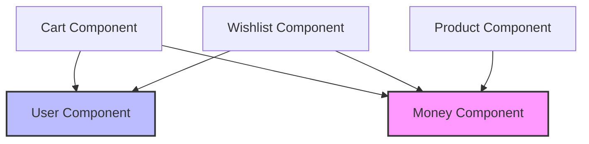

Components are the core business logic modules in this architecture. Each component encapsulates a specific domain area with its own use cases, domain models, repositories, and data layer.

## Component Structure

Each component follows a consistent layered architecture:

```
component/
├── domain/
│   ├── model/        # Domain entities and value objects
│   ├── repository/   # Repository interfaces
│   └── usecase/      # Business logic use cases
├── data/
│   ├── model/        # DTOs for API/Cache
│   └── repository/   # Repository implementations
└── di/              # Dependency injection setup
```

## Available Components

<CardGroup cols={2}>
  <Card title="Cart Component" icon="cart-shopping" href="/components/cart">
    Manages user shopping cart with add, update, and observe operations
  </Card>
  <Card title="Product Component" icon="box" href="/components/product">
    Handles product catalog retrieval from remote API
  </Card>
  <Card title="User Component" icon="user" href="/components/user">
    Authentication and user session management
  </Card>
  <Card title="Wishlist Component" icon="heart" href="/components/wishlist">
    User wishlist management with add, remove, and observe operations
  </Card>
  <Card title="Money Component" icon="dollar-sign" href="/components/money">
    Shared domain model for monetary values across components
  </Card>
</CardGroup>

## Design Principles

### 1. Domain-Driven Design

Each component is organized around a specific domain:
- **Cart**: Shopping cart management
- **Product**: Product catalog
- **User**: Authentication and user data
- **Wishlist**: User favorites
- **Money**: Shared monetary value representation

### 2. Clean Architecture Layers

<Steps>
  <Step title="Domain Layer">
    Contains business logic, entities, and repository interfaces. This layer has no dependencies on external frameworks.
  </Step>
  <Step title="Data Layer">
    Implements repository interfaces with actual data sources (HTTP, Cache). Depends on domain layer.
  </Step>
  <Step title="DI Layer">
    Assembles dependencies and provides component instances to the application.
  </Step>
</Steps>

### 3. Use Case Pattern

All business logic is encapsulated in single-purpose use cases:

```kotlin
fun interface AddCartItem {
    operator fun invoke(cartItem: CartItem)
}
```

Benefits:
- Clear separation of concerns
- Easy to test in isolation
- Explicit dependencies via constructor injection

### 4. Repository Pattern

Data access is abstracted through repository interfaces:

```kotlin
internal interface CartRepository {
    fun updateCartItem(userId: String, cartItem: CartItem)
    fun observeCart(userId: String): Flow<Cart>
    fun getCart(userId: String): Cart
}
```

## Component Dependencies



<Note>
  **Money** and **User** components are shared dependencies used by multiple components.
</Note>

## Cross-Component Communication

Components communicate through:

1. **Shared Domain Models**: The `Money` domain model is reused across components
2. **Use Case Dependencies**: Components depend on use cases from other components (e.g., `GetUser`)
3. **No Direct Coupling**: Components don't directly depend on each other's repositories or data layers

## Module Isolation

<Tip>
  Each component is in its own Gradle module with `internal` visibility for implementation details, ensuring encapsulation.
</Tip>

```kotlin
// Public API (exposed)
fun interface ObserveUserCart {
    operator fun invoke(): Flow<Cart>
}

// Internal implementation (hidden)
internal class ObserveUserCartUseCase(...) : ObserveUserCart
```

## Testing Strategy

Each component includes:
- **Unit tests** for use cases
- **Unit tests** for repositories
- **Test doubles** for easy testing in dependent modules

Example test repository:

```kotlin
class TestCartRepository : CartRepository {
    var cartToReturn = Cart(emptyList())
    
    override fun getCart(userId: String): Cart = cartToReturn
    // ...
}
```

## Next Steps

<CardGroup cols={2}>
  <Card title="Cart Component" icon="arrow-right" href="/components/cart">
    Explore cart use cases and implementation
  </Card>
  <Card title="Product Component" icon="arrow-right" href="/components/product">
    Learn about product retrieval from API
  </Card>
</CardGroup>
