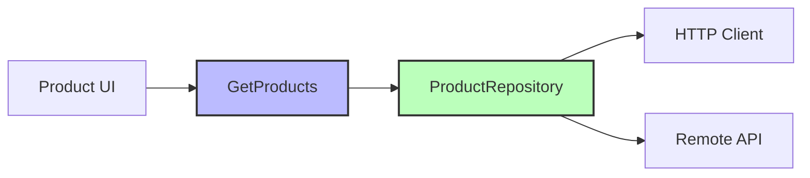
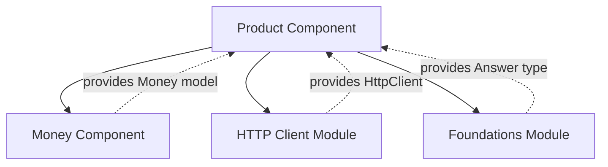

The Product component handles fetching the product catalog from a remote API. It demonstrates Clean Architecture principles with a clear separation between domain and data layers.

## Architecture



## Use Case

### GetProducts

Retrieves the complete product catalog from the remote API.

```kotlin product-component/src/commonMain/kotlin/com/denisbrandi/androidrealca/product/domain/usecase/GetProducts.kt
fun interface GetProducts {
    suspend operator fun invoke(): Answer<List<Product>, Unit>
}
```

<ParamField path="return" type="Answer<List<Product>, Unit>">
  Returns an `Answer` type that represents either:
  - **Success**: List of products
  - **Error**: Unit (no specific error details)
</ParamField>

<Note>
  The use case is defined as a functional interface, allowing it to be implemented with a lambda or method reference.
</Note>

## Domain Model

### Product

Represents a product in the catalog.

```kotlin product-component/src/commonMain/kotlin/com/denisbrandi/androidrealca/product/domain/model/Product.kt
data class Product(
    val id: String,
    val name: String,
    val money: Money,
    val imageUrl: String
)
```

<ResponseField name="id" type="String" required>
  Unique identifier for the product
</ResponseField>

<ResponseField name="name" type="String" required>
  Display name of the product
</ResponseField>

<ResponseField name="money" type="Money" required>
  Price with currency information (see [Money Component](/components/money))
</ResponseField>

<ResponseField name="imageUrl" type="String" required>
  URL to the product image
</ResponseField>

## Repository

### Interface

The domain layer defines a clean contract for product data access:

```kotlin product-component/src/commonMain/kotlin/com/denisbrandi/androidrealca/product/domain/repository/ProductRepository.kt
internal interface ProductRepository {
    suspend fun getProducts(): Answer<List<Product>, Unit>
}
```

### Implementation: RealProductRepository

The data layer implements the repository using Ktor HTTP client.

```kotlin product-component/src/commonMain/kotlin/com/denisbrandi/androidrealca/product/data/repository/RealProductRepository.kt
internal class RealProductRepository(
    private val httpClient: HttpClient
) : ProductRepository {
    override suspend fun getProducts(): Answer<List<Product>, Unit> {
        return try {
            val response =
                httpClient.get("https://api.json-generator.com/templates/Vc6TVI8VwZNT/data") {
                    headers {
                        append(HttpHeaders.ContentType, ContentType.Application.Json.toString())
                        val accessTokenHeader = AccessTokenProvider.getAccessTokenHeader()
                        append(accessTokenHeader.first, accessTokenHeader.second)
                    }
                }
            if (response.status.isSuccess()) {
                handleSuccessfulProductsResponse(response)
            } else {
                Answer.Error(Unit)
            }
        } catch (t: Throwable) {
            Answer.Error(Unit)
        }
    }

    private suspend fun handleSuccessfulProductsResponse(httpResponse: HttpResponse): Answer<List<Product>, Unit> {
        val responseBody = httpResponse.body<List<JsonProductResponseDTO>>()
        return Answer.Success(mapProducts(responseBody))
    }

    private fun mapProducts(jsonProducts: List<JsonProductResponseDTO>): List<Product> {
        return jsonProducts.map { jsonProduct ->
            Product(
                jsonProduct.id.toString(),
                jsonProduct.name,
                Money(jsonProduct.price, jsonProduct.currency),
                jsonProduct.imageUrl
            )
        }
    }
}
```

<AccordionGroup>
  <Accordion title="HTTP Request Details">
    - **Endpoint**: `https://api.json-generator.com/templates/Vc6TVI8VwZNT/data`
    - **Method**: GET
    - **Headers**: Content-Type (JSON) + Access Token
    - **Authentication**: Uses `AccessTokenProvider` for API credentials
  </Accordion>
  
  <Accordion title="Error Handling">
    - Network failures return `Answer.Error(Unit)`
    - Non-success HTTP status codes return `Answer.Error(Unit)`
    - All exceptions are caught and converted to errors
  </Accordion>
  
  <Accordion title="Data Mapping">
    - Converts `JsonProductResponseDTO` to domain `Product` model
    - Maps JSON price/currency to `Money` domain object
    - Converts numeric product ID to String
  </Accordion>
</AccordionGroup>

## Data Transfer Objects

The data layer uses DTOs to represent the API response format:

```kotlin product-component/src/commonMain/kotlin/com/denisbrandi/androidrealca/product/data/model/JsonProductResponseDTO.kt
@Serializable
data class JsonProductResponseDTO(
    val id: Int,
    val name: String,
    val price: Double,
    val currency: String,
    val imageUrl: String
)
```

<Warning>
  DTOs are **internal to the data layer** and never exposed to the domain layer or UI. The repository performs the mapping.
</Warning>

## Answer Type

The component uses the `Answer` type from the Foundations module to represent operation results:

```kotlin
sealed interface Answer<out S, out E> {
    data class Success<out S>(val data: S) : Answer<S, Nothing>
    data class Error<out E>(val error: E) : Answer<Nothing, E>
}
```

<Tip>
  `Answer` is a type-safe alternative to exceptions for expected errors, making error handling explicit at compile time.
</Tip>

## Key Features

<CardGroup cols={2}>
  <Card title="Clean Architecture" icon="layer-group">
    Clear separation between domain logic and data implementation
  </Card>
  <Card title="Type-Safe Errors" icon="shield-check">
    Uses `Answer` type instead of throwing exceptions
  </Card>
  <Card title="Multiplatform" icon="mobile">
    Built with Kotlin Multiplatform (commonMain)
  </Card>
  <Card title="Ktor Client" icon="network-wired">
    Modern async HTTP client with coroutines
  </Card>
</CardGroup>

## Dependencies



<CardGroup cols={2}>
  <Card title="Money Component" icon="dollar-sign" href="/components/money">
    Provides `Money` domain model for product pricing
  </Card>
  <Card title="Foundations Module" icon="cube">
    Provides `Answer` type for result handling
  </Card>
</CardGroup>

## Usage Example

```kotlin
// Inject use case
val getProducts: GetProducts = ...

// Fetch products
val result = getProducts()

when (result) {
    is Answer.Success -> {
        val products = result.data
        // Display products in UI
    }
    is Answer.Error -> {
        // Show error message
    }
}
```

## Testing

The component includes:

<Steps>
  <Step title="Repository Tests">
    `RealProductRepositoryTest.kt` tests:
    - Successful API responses
    - Error handling for failed requests
    - DTO to domain model mapping
  </Step>
</Steps>

<Note>
  Since the use case is just a thin wrapper around the repository, most testing focuses on the repository implementation.
</Note>

## Integration Points

### Used By

- **Product List UI** (plp-ui module)
- **Cart Component** (converts products to cart items)
- **Wishlist Component** (converts products to wishlist items)

### Example: Converting Product to CartItem

```kotlin
val product: Product = ...

val cartItem = CartItem(
    id = product.id,
    name = product.name,
    money = product.money,
    imageUrl = product.imageUrl,
    quantity = 1
)

addCartItem(cartItem)
```

## Related Components

<CardGroup cols={2}>
  <Card title="Cart Component" icon="cart-shopping" href="/components/cart">
    Products are added to cart as CartItems
  </Card>
  <Card title="Wishlist Component" icon="heart" href="/components/wishlist">
    Products are added to wishlist as WishlistItems
  </Card>
</CardGroup>
