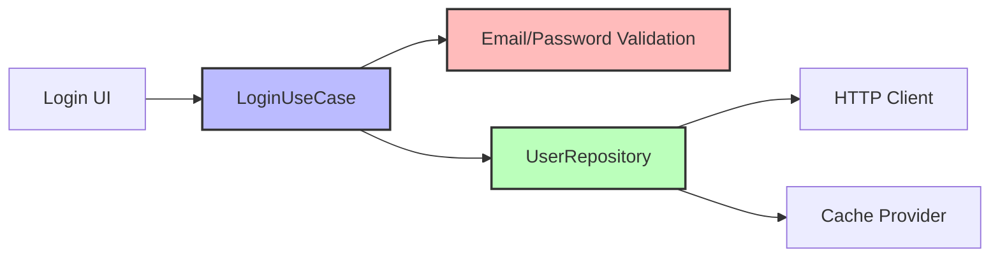
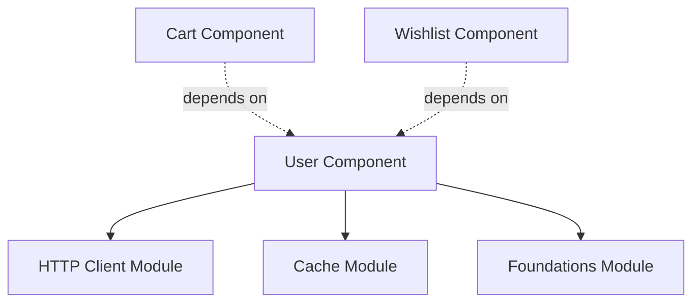

The User component handles user authentication, session management, and user data persistence. It demonstrates domain validation with value objects and Clean Architecture error handling.

## Architecture



## Use Cases

The user component provides three primary use cases:

<CardGroup cols={3}>
  <Card title="Login" icon="right-to-bracket">
    Authenticate user with validation
  </Card>
  <Card title="GetUser" icon="user">
    Retrieve current logged-in user
  </Card>
  <Card title="IsUserLoggedIn" icon="circle-check">
    Check authentication status
  </Card>
</CardGroup>

### Login

Authenticates a user with email and password validation.

<CodeGroup>
```kotlin user-component/src/commonMain/kotlin/com/denisbrandi/androidrealca/user/domain/usecase/LoginUseCase.kt
internal class LoginUseCase(
    private val userRepository: UserRepository
) : Login {
    override suspend fun invoke(loginRequest: LoginRequest): Answer<Unit, LoginError> {
        return when {
            !Email(loginRequest.email).isValid() -> {
                Answer.Error(LoginError.InvalidEmail)
            }

            !Password(loginRequest.password).isValid() -> {
                Answer.Error(LoginError.InvalidPassword)
            }

            else -> {
                return userRepository.login(loginRequest)
            }
        }
    }
}
```

```kotlin Interface
fun interface Login {
    suspend operator fun invoke(loginRequest: LoginRequest): Answer<Unit, LoginError>
}
```
</CodeGroup>

<Tip>
  **Client-Side Validation**: Email and password are validated before making the API call, providing immediate feedback and reducing unnecessary network requests.
</Tip>

### GetUser & IsUserLoggedIn

```kotlin user-component/src/commonMain/kotlin/com/denisbrandi/androidrealca/user/domain/usecase/UserUseCases.kt
fun interface GetUser {
    operator fun invoke(): User
}

fun interface IsUserLoggedIn {
    operator fun invoke(): Boolean
}
```

<Note>
  These use cases are **synchronous** because they read from local cache, not remote API.
</Note>

## Domain Models

### User

Represents an authenticated user.

```kotlin user-component/src/commonMain/kotlin/com/denisbrandi/androidrealca/user/domain/model/User.kt
data class User(val id: String, val fullName: String)
```

### LoginRequest

Credentials for authentication.

```kotlin user-component/src/commonMain/kotlin/com/denisbrandi/androidrealca/user/domain/model/LoginRequest.kt
data class LoginRequest(val email: String, val password: String)
```

### Value Objects: Email & Password

Domain validation is encapsulated in value objects:

<CodeGroup>
```kotlin Email
class Email(private val value: String) {
    fun isValid(): Boolean {
        return value.isNotBlank() && value.matches(Regex(EMAIL_ADDRESS_PATTERN))
    }

    private companion object {
        const val EMAIL_ADDRESS_PATTERN =
            "(?:[a-zA-Z0-9!#$%&'*+/=?^_`{|}~-]+(?:\\.[a-zA-Z0-9!#$%&'*+/=?^_`{|}~-]+)*|\"(?:[\\x01-\\x08\\x0b\\x0c\\x0e-\\x1f\\x21\\x23-\\x5b\\x5d-\\x7f]|\\\\[\\x01-\\x09\\x0b\\x0c\\x0e-\\x7f])*\")@(?:(?:[a-zA-Z0-9](?:[a-zA-Z0-9-]*[a-zA-Z0-9])?\\.)+[a-zA-Z0-9](?:[a-zA-Z0-9-]*[a-zA-Z0-9])?|\\[(?:(?:25[0-5]|2[0-4][0-9]|[01]?[0-9][0-9]?)\\.){3}(?:25[0-5]|2[0-4][0-9]|[01]?[0-9][0-9]?|[a-zA-Z0-9-]*[a-zA-Z0-9]:(?:[\\x01-\\x08\\x0b\\x0c\\x0e-\\x1f\\x21-\\x5a\\x53-\\x7f]|\\\\[\\x01-\\x09\\x0b\\x0c\\x0e-\\x7f])+)\\])"
    }
}
```

```kotlin Password
class Password(private val value: String) {

    fun isValid(): Boolean {
        return value.length >= 8
    }
}
```
</CodeGroup>

<AccordionGroup>
  <Accordion title="Email Validation">
    - Must not be blank
    - Must match RFC 5322 email pattern
    - Comprehensive regex for valid email formats
  </Accordion>
  
  <Accordion title="Password Validation">
    - Minimum 8 characters
    - No complexity requirements (can be enhanced)
  </Accordion>
</AccordionGroup>

### LoginError

Typed errors for authentication failures.

```kotlin user-component/src/commonMain/kotlin/com/denisbrandi/androidrealca/user/domain/model/LoginError.kt
sealed interface LoginError {
    data object InvalidEmail : LoginError
    data object InvalidPassword : LoginError
    data object GenericError : LoginError
    data object IncorrectCredentials : LoginError
}
```

<ResponseField name="InvalidEmail" type="LoginError">
  Email format validation failed
</ResponseField>

<ResponseField name="InvalidPassword" type="LoginError">
  Password doesn't meet requirements (< 8 chars)
</ResponseField>

<ResponseField name="IncorrectCredentials" type="LoginError">
  Server returned 401 (wrong email/password)
</ResponseField>

<ResponseField name="GenericError" type="LoginError">
  Network error or unexpected server response
</ResponseField>

## Repository

### Interface

```kotlin user-component/src/commonMain/kotlin/com/denisbrandi/androidrealca/user/domain/repository/UserRepository.kt
internal interface UserRepository {
    suspend fun login(loginRequest: LoginRequest): Answer<Unit, LoginError>
    fun getUser(): User
    fun isLoggedIn(): Boolean
}
```

### Implementation: RealUserRepository

The repository handles both HTTP authentication and local cache persistence.

```kotlin user-component/src/commonMain/kotlin/com/denisbrandi/androidrealca/user/data/repository/RealUserRepository.kt
internal class RealUserRepository(
    private val client: HttpClient,
    cacheProvider: CacheProvider
) : UserRepository {

    private val cachedObject: CachedObject<JsonUserCacheDTO> by lazy {
        cacheProvider.getCachedObject(
            fileName = "user-cache",
            serializer = JsonUserCacheDTO.serializer(),
            defaultValue = DEFAULT_USER
        )
    }

    override suspend fun login(loginRequest: LoginRequest): Answer<Unit, LoginError> {
        return try {
            val response =
                client.post("https://api.json-generator.com/templates/Q7s_NUVpyBND/data") {
                    headers {
                        append(HttpHeaders.ContentType, ContentType.Application.Json.toString())
                        val accessTokenHeader = AccessTokenProvider.getAccessTokenHeader()
                        append(accessTokenHeader.first, accessTokenHeader.second)
                    }
                    setBody(JsonLoginRequestDTO(loginRequest.email, loginRequest.password))
                }
            if (response.status.isSuccess()) {
                handleSuccessfulLoginResponse(response)
            } else {
                handleFailingLoginResponse(response)
            }
        } catch (t: Throwable) {
            t.printStackTrace()
            Answer.Error(LoginError.GenericError)
        }
    }

    private suspend fun handleSuccessfulLoginResponse(httpResponse: HttpResponse): Answer<Unit, LoginError> {
        val responseBody = httpResponse.body<JsonLoginResponseDTO>()
        cachedObject.put(JsonUserCacheDTO(responseBody.id, responseBody.fullName))
        return Answer.Success(Unit)
    }

    private fun handleFailingLoginResponse(httpResponse: HttpResponse): Answer<Unit, LoginError> {
        val error = if (httpResponse.status.value == 401) {
            LoginError.IncorrectCredentials
        } else {
            LoginError.GenericError
        }
        return Answer.Error(error)
    }

    override fun getUser(): User {
        val cachedUser = cachedObject.get()
        return User(cachedUser.id, cachedUser.fullName)
    }

    override fun isLoggedIn(): Boolean {
        return cachedObject.get() != DEFAULT_USER
    }

    companion object {
        val DEFAULT_USER = JsonUserCacheDTO("", "")
    }
}
```

<AccordionGroup>
  <Accordion title="Login Flow">
    1. POST credentials to API endpoint
    2. On success (2xx):
       - Parse `JsonLoginResponseDTO`
       - Store user in cache as `JsonUserCacheDTO`
       - Return `Answer.Success`
    3. On 401:
       - Return `LoginError.IncorrectCredentials`
    4. On other errors:
       - Return `LoginError.GenericError`
  </Accordion>
  
  <Accordion title="Session Management">
    - User data stored in local cache
    - `isLoggedIn()` checks if cached user != DEFAULT_USER
    - Session persists across app restarts
    - No explicit logout in this implementation
  </Accordion>
  
  <Accordion title="Error Mapping">
    - HTTP 401 → `IncorrectCredentials`
    - Other HTTP errors → `GenericError`
    - Network exceptions → `GenericError`
  </Accordion>
</AccordionGroup>

## Key Features

<CardGroup cols={2}>
  <Card title="Domain Validation" icon="check-circle">
    Email and password validated with value objects
  </Card>
  <Card title="Type-Safe Errors" icon="shield-halved">
    Sealed interface for explicit error handling
  </Card>
  <Card title="Persistent Session" icon="floppy-disk">
    User data cached locally, survives restarts
  </Card>
  <Card title="Clean Separation" icon="layer-group">
    Domain logic isolated from HTTP/cache details
  </Card>
</CardGroup>

## Usage Example

```kotlin
// Login
val login: Login = ...
val loginRequest = LoginRequest(
    email = "user@example.com",
    password = "password123"
)

val result = login(loginRequest)
when (result) {
    is Answer.Success -> {
        // Navigate to main screen
    }
    is Answer.Error -> when (result.error) {
        LoginError.InvalidEmail -> showError("Invalid email format")
        LoginError.InvalidPassword -> showError("Password must be at least 8 characters")
        LoginError.IncorrectCredentials -> showError("Wrong email or password")
        LoginError.GenericError -> showError("Login failed. Please try again.")
    }
}

// Check login status
val isUserLoggedIn: IsUserLoggedIn = ...
if (isUserLoggedIn()) {
    // Show main content
} else {
    // Show login screen
}

// Get current user
val getUser: GetUser = ...
val user = getUser()
println("Welcome, ${user.fullName}!")
```

## Testing

The component includes comprehensive tests:

<Steps>
  <Step title="Use Case Tests">
    `LoginUseCaseTest.kt` tests:
    - Email validation failure
    - Password validation failure
    - Successful login delegation to repository
  </Step>
  
  <Step title="Repository Tests">
    `RealUserRepositoryTest.kt` tests:
    - Successful login and cache storage
    - HTTP error handling
    - Session state management
  </Step>
  
  <Step title="Value Object Tests">
    - `EmailTest.kt`: Various email formats
    - `PasswordTest.kt`: Length validation
  </Step>
</Steps>

## Dependencies



<Warning>
  **Widely Used**: Cart and Wishlist components depend on the `GetUser` use case to retrieve the current user's ID.
</Warning>

## Related Components

<CardGroup cols={2}>
  <Card title="Cart Component" icon="cart-shopping" href="/components/cart">
    Uses `GetUser` to retrieve user-specific cart data
  </Card>
  <Card title="Wishlist Component" icon="heart" href="/components/wishlist">
    Uses `GetUser` to retrieve user-specific wishlist
  </Card>
</CardGroup>
