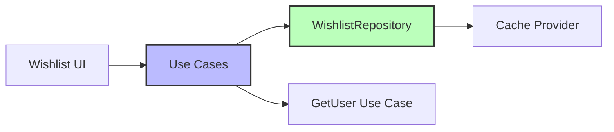
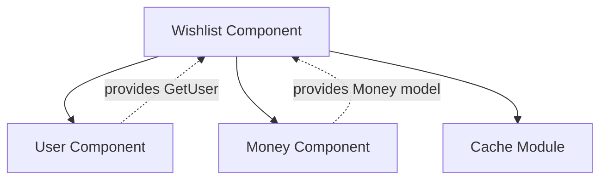

The Wishlist component manages a user's favorite products with reactive updates and persistent storage. It mirrors the Cart component's architecture with simplified domain logic.

## Architecture



## Use Cases

The wishlist component provides four primary use cases:

<CardGroup cols={2}>
  <Card title="AddToWishlist" icon="heart-circle-plus">
    Add products to user's wishlist
  </Card>
  <Card title="RemoveFromWishlist" icon="heart-circle-minus">
    Remove products from wishlist
  </Card>
  <Card title="ObserveUserWishlist" icon="eye">
    Reactive observation of wishlist items
  </Card>
  <Card title="ObserveUserWishlistIds" icon="hashtag">
    Reactive observation of wishlist item IDs only
  </Card>
</CardGroup>

### AddToWishlist

Adds a product to the user's wishlist. Prevents duplicates automatically.

<CodeGroup>
```kotlin wishlist-component/src/commonMain/kotlin/com/denisbrandi/androidrealca/wishlist/domain/usecase/AddToWishlistUseCase.kt
internal class AddToWishlistUseCase(
    private val getUser: GetUser,
    private val wishlistRepository: WishlistRepository
) : AddToWishlist {
    override fun invoke(wishlistItem: WishlistItem) {
        wishlistRepository.addToWishlist(getUser().id, wishlistItem)
    }
}
```

```kotlin Interface
fun interface AddToWishlist {
    operator fun invoke(wishlistItem: WishlistItem)
}
```
</CodeGroup>

### RemoveFromWishlist

Removes a product from the wishlist by ID.

<CodeGroup>
```kotlin wishlist-component/src/commonMain/kotlin/com/denisbrandi/androidrealca/wishlist/domain/usecase/RemoveFromWishlistUseCase.kt
internal class RemoveFromWishlistUseCase(
    private val getUser: GetUser,
    private val wishlistRepository: WishlistRepository
) : RemoveFromWishlist {
    override fun invoke(wishlistItemId: String) {
        wishlistRepository.removeFromWishlist(getUser().id, wishlistItemId)
    }
}
```

```kotlin Interface
fun interface RemoveFromWishlist {
    operator fun invoke(wishlistItemId: String)
}
```
</CodeGroup>

<Note>
  Remove takes only the **item ID**, not the full object, making it convenient for UI interactions.
</Note>

### ObserveUserWishlist

Provides a reactive `Flow` of the complete wishlist.

<CodeGroup>
```kotlin wishlist-component/src/commonMain/kotlin/com/denisbrandi/androidrealca/wishlist/domain/usecase/ObserveUserWishlistUseCase.kt
internal class ObserveUserWishlistUseCase(
    private val getUser: GetUser,
    private val wishlistRepository: WishlistRepository
) : ObserveUserWishlist {
    override fun invoke(): Flow<List<WishlistItem>> {
        return wishlistRepository.observeWishlist(getUser().id)
    }
}
```

```kotlin Interface
fun interface ObserveUserWishlist {
    operator fun invoke(): Flow<List<WishlistItem>>
}
```
</CodeGroup>

### ObserveUserWishlistIds

Provides a reactive `Flow` of just the wishlist item IDs (for efficiently checking if items are favorited).

```kotlin wishlist-component/src/commonMain/kotlin/com/denisbrandi/androidrealca/wishlist/domain/usecase/WishlistUseCases.kt
fun interface ObserveUserWishlistIds {
    operator fun invoke(): Flow<List<String>>
}
```

<Tip>
  Use `ObserveUserWishlistIds` in product lists to efficiently show heart icons without loading full wishlist data.
</Tip>

## Domain Model

### WishlistItem

Represents a product saved to the wishlist.

```kotlin wishlist-component/src/commonMain/kotlin/com/denisbrandi/androidrealca/wishlist/domain/model/WishlistItem.kt
data class WishlistItem(
    val id: String,
    val name: String,
    val money: Money,
    val imageUrl: String
)
```

<ParamField path="id" type="String" required>
  Unique identifier for the product
</ParamField>

<ParamField path="name" type="String" required>
  Display name of the product
</ParamField>

<ParamField path="money" type="Money" required>
  Price information (amount + currency)
</ParamField>

<ParamField path="imageUrl" type="String" required>
  URL for the product image
</ParamField>

<Note>
  Unlike `CartItem`, wishlist items don't have a `quantity` field since wishlists typically just track "liked" vs "not liked".
</Note>

## Repository

The repository interface defines data operations:

```kotlin wishlist-component/src/commonMain/kotlin/com/denisbrandi/androidrealca/wishlist/domain/repository/WishlistRepository.kt
internal interface WishlistRepository {
    fun addToWishlist(userId: String, wishlistItem: WishlistItem)
    fun removeFromWishlist(userId: String, wishlistItemId: String)
    fun observeWishlist(userId: String): Flow<List<WishlistItem>>
}
```

### Implementation: RealWishlistRepository

The repository stores wishlist data in local cache.

```kotlin wishlist-component/src/commonMain/kotlin/com/denisbrandi/androidrealca/wishlist/data/repository/RealWishlistRepository.kt
internal class RealWishlistRepository(
    private val cacheProvider: CacheProvider
) : WishlistRepository {

    private val flowCachedObject: FlowCachedObject<JsonWishlistCacheDto> by lazy {
        cacheProvider.getFlowCachedObject(
            fileName = "wishlist-cache",
            serializer = JsonWishlistCacheDto.serializer(),
            defaultValue = JsonWishlistCacheDto(emptyMap())
        )
    }

    override fun addToWishlist(userId: String, wishlistItem: WishlistItem) {
        val updatedCache = getUpdatedCacheForUser(userId) { userWishlist ->
            if (userWishlist.find { it.id == wishlistItem.id } == null) {
                userWishlist.add(mapToDto(wishlistItem))
            }
        }
        flowCachedObject.put(updatedCache)
    }

    override fun removeFromWishlist(userId: String, wishlistItemId: String) {
        val updatedCache = getUpdatedCacheForUser(userId) { userWishlist ->
            userWishlist.find { it.id == wishlistItemId }?.let { itemToRemove ->
                userWishlist.remove(itemToRemove)
            }
        }
        flowCachedObject.put(updatedCache)
    }

    private fun getUpdatedCacheForUser(
        userId: String,
        onUserWishlist: (MutableList<JsonWishlistItemCacheDTO>) -> Unit
    ): JsonWishlistCacheDto {
        val usersWishlist = flowCachedObject.get().usersWishlist
        val userWishlist = usersWishlist[userId].orEmpty().toMutableList()
        return JsonWishlistCacheDto(
            usersWishlist = usersWishlist.toMutableMap().apply {
                put(
                    userId,
                    userWishlist.apply {
                        onUserWishlist(this)
                    }.toList()
                )
            }
        )
    }

    override fun observeWishlist(userId: String): Flow<List<WishlistItem>> {
        return flowCachedObject.observe().map { cachedDto ->
            mapToWishlistItems(cachedDto.usersWishlist[userId] ?: emptyList())
        }
    }

    private fun mapToWishlistItems(dtos: List<JsonWishlistItemCacheDTO>): List<WishlistItem> {
        return dtos.map { dto ->
            WishlistItem(
                id = dto.id,
                name = dto.name,
                money = Money(dto.price, dto.currency),
                imageUrl = dto.imageUrl
            )
        }
    }

    private fun mapToDto(wishlistItem: WishlistItem): JsonWishlistItemCacheDTO {
        return JsonWishlistItemCacheDTO(
            id = wishlistItem.id,
            name = wishlistItem.name,
            price = wishlistItem.money.amount,
            currency = wishlistItem.money.currencySymbol,
            imageUrl = wishlistItem.imageUrl
        )
    }
}
```

<AccordionGroup>
  <Accordion title="Duplicate Prevention">
    When adding an item, the repository checks if it already exists by ID and only adds if not present.
  </Accordion>
  
  <Accordion title="Multi-User Support">
    Like the cart, wishlists are stored per-user using `userId` as the key.
  </Accordion>
  
  <Accordion title="Reactive Updates">
    Changes are broadcast via `Flow`, allowing UI to react automatically.
  </Accordion>
  
  <Accordion title="Persistent Storage">
    Wishlist data is stored in cache and survives app restarts.
  </Accordion>
</AccordionGroup>

## Key Features

<CardGroup cols={2}>
  <Card title="Reactive Updates" icon="bolt">
    UI automatically reflects wishlist changes via Flow
  </Card>
  <Card title="Duplicate Prevention" icon="shield-check">
    Automatically prevents adding the same item twice
  </Card>
  <Card title="User Isolation" icon="users">
    Each user has a separate wishlist
  </Card>
  <Card title="Persistent Storage" icon="database">
    Wishlist persists across app restarts
  </Card>
</CardGroup>

## Dependencies



<CardGroup cols={2}>
  <Card title="User Component" icon="user" href="/components/user">
    Provides `GetUser` use case for accessing current user ID
  </Card>
  <Card title="Money Component" icon="dollar-sign" href="/components/money">
    Provides `Money` domain model for pricing
  </Card>
</CardGroup>

## Usage Example

```kotlin
// Add to wishlist
val wishlistItem = WishlistItem(
    id = "product-123",
    name = "Widget",
    money = Money(29.99, "$"),
    imageUrl = "https://..."
)
addToWishlist(wishlistItem)

// Observe full wishlist
observeUserWishlist().collect { items ->
    // Update wishlist UI
}

// Observe just IDs (for product list hearts)
observeUserWishlistIds().collect { ids ->
    val isFavorited = ids.contains("product-123")
    // Update heart icon
}

// Remove from wishlist
removeFromWishlist("product-123")
```

## Comparison with Cart Component

| Feature | Cart | Wishlist |
|---------|------|----------|
| **Items** | CartItem (with quantity) | WishlistItem (no quantity) |
| **Add Logic** | Merge quantities if exists | Prevent duplicates |
| **Remove** | Set quantity to 0 | Remove by ID |
| **Domain Logic** | getSubtotal(), getNumberOfItems() | No aggregate calculations |
| **Use Cases** | AddCartItem, UpdateCartItem, ObserveUserCart | AddToWishlist, RemoveFromWishlist, ObserveUserWishlist, ObserveUserWishlistIds |

<Note>
  Both components share the same architectural pattern but differ in domain logic complexity.
</Note>

## Testing

The component includes comprehensive tests:

<Steps>
  <Step title="Use Case Tests">
    - `AddToWishlistUseCaseTest.kt`
    - `RemoveFromWishlistUseCaseTest.kt`
    - `ObserveUserWishlistTest.kt`
    - `ObserveUserWishlistIdsUseCaseTest.kt`
  </Step>
  
  <Step title="Repository Tests">
    `RealWishlistRepositoryTest.kt` tests:
    - Adding items
    - Duplicate prevention
    - Removing items
    - Multi-user isolation
  </Step>
</Steps>

## Integration Points

### Converting Product to WishlistItem

```kotlin
val product: Product = ...

val wishlistItem = WishlistItem(
    id = product.id,
    name = product.name,
    money = product.money,
    imageUrl = product.imageUrl
)

addToWishlist(wishlistItem)
```

### Checking if Product is Wishlisted

```kotlin
val productId = "product-123"

observeUserWishlistIds().collect { wishlistIds ->
    val isWishlisted = wishlistIds.contains(productId)
    heartIcon.isSelected = isWishlisted
}
```

## Related Components

<CardGroup cols={2}>
  <Card title="Cart Component" icon="cart-shopping" href="/components/cart">
    Similar architecture with quantity management
  </Card>
  <Card title="Product Component" icon="box" href="/components/product">
    Products are added to wishlist as WishlistItems
  </Card>
</CardGroup>
