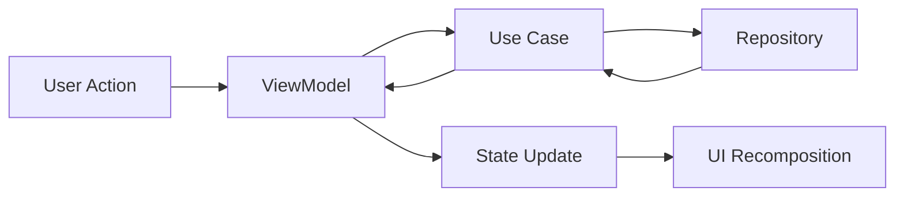

The **Presentation Layer** handles all UI-related logic in the application. It uses Jetpack Compose for UI and ViewModels for state management, consuming use cases from the domain layer.

## Key Components

The presentation layer consists of:

1. **ViewModels** - Manage UI state and business logic coordination
2. **Compose Screens** - Declarative UI components
3. **Screen State** - Immutable state representations

## ViewModels

ViewModels observe domain use cases and expose state to the UI. They survive configuration changes and manage coroutine scopes.

### Example: RealCartViewModel

```kotlin cart-ui/src/main/java/com/denisbrandi/androidrealca/cart/presentation/viewmodel/RealCartViewModel.kt
package com.denisbrandi.androidrealca.cart.presentation.viewmodel

import androidx.lifecycle.*
import com.denisbrandi.androidrealca.cart.domain.model.*
import com.denisbrandi.androidrealca.cart.domain.usecase.*
import com.denisbrandi.androidrealca.viewmodel.*
import kotlinx.coroutines.flow.*

internal class RealCartViewModel(
    observeUserCart: ObserveUserCart,
    private val updateCartItem: UpdateCartItem,
    private val stateDelegate: StateDelegate<CartScreenState>
) : CartViewModel, StateViewModel<CartScreenState> by stateDelegate, ViewModel() {

    init {
        stateDelegate.setDefaultState(CartScreenState(Cart(emptyList())))
        observeUserCart().onEach { cart ->
            stateDelegate.updateState { CartScreenState(cart) }
        }.launchIn(viewModelScope)
    }

    override fun updateCartItemQuantity(cartItem: CartItem) {
        updateCartItem(cartItem)
    }
}
```

<Note>
**ViewModel Pattern:**
- Observes `ObserveUserCart` use case in `init` block
- Updates state reactively when cart changes
- Delegates user actions to `UpdateCartItem` use case
- Uses `StateDelegate` for state management
</Note>

### Example: RealMainViewModel

```kotlin main-ui/src/main/java/com/denisbrandi/androidrealca/main/presentation/viewmodel/RealMainViewModel.kt
package com.denisbrandi.androidrealca.main.presentation.viewmodel

import androidx.lifecycle.*
import com.denisbrandi.androidrealca.cart.domain.usecase.ObserveUserCart
import com.denisbrandi.androidrealca.viewmodel.*
import com.denisbrandi.androidrealca.wishlist.domain.usecase.ObserveUserWishlistIds
import kotlinx.coroutines.flow.*

internal class RealMainViewModel(
    observeUserWishlistIds: ObserveUserWishlistIds,
    observeUserCart: ObserveUserCart,
    stateDelegate: StateDelegate<MainScreenState>
) : MainViewModel, StateViewModel<MainScreenState> by stateDelegate, ViewModel() {

    init {
        stateDelegate.setDefaultState(MainScreenState())
        observeUserWishlistIds().onEach { list ->
            stateDelegate.updateState { state -> state.copy(wishlistBadge = list.size) }
        }.launchIn(viewModelScope)
        observeUserCart().onEach { cart ->
            stateDelegate.updateState { state -> state.copy(cartBadge = cart.getNumberOfItems()) }
        }.launchIn(viewModelScope)
    }
}
```

<Tip>
**Multiple Use Cases:**
This ViewModel demonstrates observing multiple use cases simultaneously to update different parts of the UI state (wishlist and cart badges).
</Tip>

## State Management

ViewModels expose immutable state through Kotlin `Flow` that UI components can observe.

```kotlin State Pattern
// ViewModel exposes state
internal class CartViewModel : StateViewModel<CartScreenState> {
    val state: StateFlow<CartScreenState>
}

// UI observes state
@Composable
private fun Body(cartViewModel: CartViewModel) {
    val cartState by cartViewModel.state.collectAsState()
    // UI updates automatically when state changes
}
```

<Check>
**State Best Practices:**
- State should be immutable (use `data class` with `val`)
- Update state using `copy()` to create new instances
- Never expose mutable state to UI
</Check>

## Compose Screens

UI is built using Jetpack Compose with a declarative approach.

### Example: CartScreen

```kotlin cart-ui/src/main/java/com/denisbrandi/androidrealca/cart/presentation/view/CartScreen.kt
package com.denisbrandi.androidrealca.cart.presentation.view

import androidx.compose.foundation.background
import androidx.compose.foundation.layout.*
import androidx.compose.foundation.lazy.*
import androidx.compose.material3.*
import androidx.compose.runtime.*
import androidx.compose.ui.*
import androidx.compose.ui.graphics.Color
import androidx.compose.ui.res.*
import androidx.compose.ui.unit.dp
import coil3.compose.AsyncImage
import com.denisbrandi.androidrealca.cart.domain.model.*
import com.denisbrandi.androidrealca.cart.presentation.viewmodel.CartViewModel

@Composable
internal fun CartScreen(
    cartViewModel: CartViewModel
) {
    Scaffold(
        topBar = {
            TopBar(stringResource(R.string.cart_title))
        },
        bottomBar = { Box(Modifier.size(0.dp)) }
    ) { padding ->
        Box(
            modifier = Modifier
                .padding(padding)
                .fillMaxWidth()
        ) {
            Body(cartViewModel)
        }
    }
}

@Composable
private fun Body(cartViewModel: CartViewModel) {
    val cartState by cartViewModel.state.collectAsState()
    if (cartState.cart.cartItems.isEmpty()) {
        FullScreenMessage(stringResource(R.string.cart_empty_message))
    } else {
        BodyContent(cartViewModel, cartState.cart)
    }
}

@Composable
private fun BodyContent(
    cartViewModel: CartViewModel,
    cart: Cart
) {
    Box(Modifier.fillMaxSize()) {
        LazyColumn(
            contentPadding = PaddingValues(vertical = halfMargin)
        ) {
            itemsIndexed(cart.cartItems) { index, item ->
                CartItemRow(cartViewModel, item, index == cart.cartItems.size - 1)
            }
        }
        cart.getSubtotal()?.let { subtotal -> CartSubTotal(subtotal) }
    }
}
```

<Note>
**Compose Architecture:**
- `CartScreen` is the top-level composable
- State is observed using `collectAsState()`
- UI automatically recomposes when state changes
- Conditional rendering based on cart items
</Note>

### Cart Item Interactions

```kotlin cart-ui/src/main/java/com/denisbrandi/androidrealca/cart/presentation/view/CartScreen.kt (continued)
@Composable
private fun CartItemRow(
    cartViewModel: CartViewModel,
    cartItem: CartItem,
    isLastItem: Boolean
) {
    Card(
        modifier = Modifier
            .padding(
                top = halfMargin,
                start = defaultMargin,
                end = defaultMargin,
                bottom = if (isLastItem) 64.dp else halfMargin
            )
            .fillMaxWidth(),
        colors = CardDefaults.cardColors(containerColor = Color.White),
        elevation = CardDefaults.cardElevation(defaultElevation = cardElevation),
        onClick = { }
    ) {
        Row(
            modifier = Modifier
                .height(cardHeight)
                .padding(horizontal = defaultMargin),
            verticalAlignment = Alignment.CenterVertically
        ) {
            AsyncImage(
                modifier = Modifier.size(cardImage),
                model = cartItem.imageUrl,
                contentDescription = null,
                placeholder = painterResource(R.drawable.baseline_image_24),
                error = painterResource(R.drawable.baseline_image_24)
            )
            Column(
                modifier = Modifier.padding(start = defaultMargin)
            ) {
                Text(
                    text = cartItem.name,
                    style = MaterialTheme.typography.titleSmall,
                    maxLines = 1
                )
                PriceText(cartItem.money)
            }

            Row(
                modifier = Modifier
                    .padding(start = halfMargin, top = defaultMargin, bottom = defaultMargin)
                    .fillMaxSize(),
                horizontalArrangement = Arrangement.End,
                verticalAlignment = Alignment.CenterVertically
            ) {
                val quantity = cartItem.quantity
                IconButton(
                    onClick = {
                        cartViewModel.updateCartItemQuantity(cartItem.copy(quantity = quantity - 1))
                    }
                ) {
                    Icon(
                        painterResource(R.drawable.baseline_remove_24),
                        contentDescription = null
                    )
                }
                MediumLabel(text = quantity.toString())
                IconButton(
                    onClick = {
                        cartViewModel.updateCartItemQuantity(cartItem.copy(quantity = quantity + 1))
                    }
                ) {
                    Icon(
                        painterResource(R.drawable.baseline_add_24),
                        contentDescription = null
                    )
                }
            }
        }
    }
}
```

<Tip>
**User Interactions:**
Buttons directly call ViewModel methods like `updateCartItemQuantity()`, which delegate to domain use cases.
</Tip>

### Example: MainScreen with Navigation

```kotlin main-ui/src/main/java/com/denisbrandi/androidrealca/main/presentation/view/MainScreen.kt
package com.denisbrandi.androidrealca.main.presentation.view

import androidx.compose.foundation.layout.*
import androidx.compose.material.icons.Icons
import androidx.compose.material.icons.filled.*
import androidx.compose.material.icons.outlined.FavoriteBorder
import androidx.compose.material3.*
import androidx.compose.runtime.*
import androidx.navigation.NavHostController
import androidx.navigation.compose.*
import com.denisbrandi.androidrealca.main.presentation.viewmodel.*

@Composable
internal fun MainScreen(
    mainViewModel: MainViewModel,
    bottomNavRouter: BottomNavRouter
) {
    val navController = rememberNavController()
    val topLevelRoutes = topLevelRoutes()
    Scaffold(
        modifier = Modifier.fillMaxSize(),
        bottomBar = {
            BottomNavigationBar(mainViewModel, topLevelRoutes, navController)
        },
        contentWindowInsets = WindowInsets(0, 0, 0, 0),
    ) { paddingValues ->
        NavHost(
            navController = navController,
            startDestination = topLevelRoutes.first().route,
            modifier = Modifier.padding(paddingValues = paddingValues)
        ) {
            composable<NavProducts> { bottomNavRouter.OpenPLPScreen() }
            composable<NavWishlist> { bottomNavRouter.OpenWishlistScreen() }
            composable<NavCart> { bottomNavRouter.OpenCartScreen() }
        }
    }
}
```

### Bottom Navigation with Badges

```kotlin main-ui/src/main/java/com/denisbrandi/androidrealca/main/presentation/view/MainScreen.kt (continued)
@Composable
private fun BottomBarIcon(
    index: Int,
    wishlistCount: Int,
    cartItemsCount: Int,
    navigationItem: TopLevelRoute<Any>
) {
    val count = when (index) {
        1 -> wishlistCount
        2 -> cartItemsCount
        else -> 0
    }
    if (count == 0) {
        Icon(navigationItem.icon, contentDescription = navigationItem.name)
    } else {
        BadgedBox(
            badge = {
                Badge {
                    Text(text = count.toString())
                }
            }
        ) {
            Icon(navigationItem.icon, contentDescription = navigationItem.name)
        }
    }
}
```

<Check>
**Navigation Pattern:**
- Uses Jetpack Navigation Compose
- Bottom navigation with badges updated from ViewModel state
- Type-safe navigation with serializable routes
</Check>

## Unidirectional Data Flow

The presentation layer follows a strict unidirectional data flow:



<Steps>
  <Step title="User Action">
    User interacts with UI (clicks button, enters text)
  </Step>
  <Step title="ViewModel Invokes Use Case">
    ViewModel delegates to domain use case
  </Step>
  <Step title="Use Case Executes Business Logic">
    Use case performs operation via repository
  </Step>
  <Step title="State Updated">
    ViewModel updates state based on result
  </Step>
  <Step title="UI Recomposes">
    Compose automatically rebuilds UI with new state
  </Step>
</Steps>

## Benefits of the Presentation Layer

<CardGroup cols={2}>
  <Card title="Reactive UI" icon="bolt">
    Compose automatically updates when state changes
  </Card>
  <Card title="Configuration Changes" icon="rotate">
    ViewModels survive configuration changes like rotation
  </Card>
  <Card title="Testable" icon="vial">
    ViewModels can be unit tested without Android dependencies
  </Card>
  <Card title="Separation of Concerns" icon="layer-group">
    UI logic separated from business logic
  </Card>
</CardGroup>

## Related Layers

<CardGroup cols={2}>
  <Card title="Domain Layer" icon="gears" href="/layers/domain">
    Provides use cases that ViewModels consume
  </Card>
  <Card title="Data Layer" icon="database" href="/layers/data">
    Provides data through repositories to use cases
  </Card>
</CardGroup>